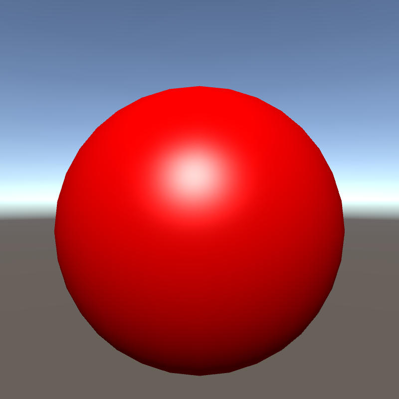

# CG_Projects
Repository of the different Computer Graphics projects that I'm working on in my spare time. Mostly focused on shader programming.

Some of the implemented CG code is based on the exercises from the Computer Graphics Programming course at Aalborg University, taught by Associate Professor Martin Kraus. These shaders are also doccumented at https://en.wikibooks.org/wiki/Cg_Programming/Unity

Computer Graphics
=================

The shaders below are implemented in the Unity3D game engine with the Cg
shading language. I have tried working with OpenGL, but I do not have
anything to showcase. Some of the shaders are based on what I was taught
in the *Computer Graphics Programing* course at AAU, and the image
effect shaders are inspired by *Unity 5.x Shaders and Effects Cookbook*,
which I used as a reference guide.

Lambertian
----------

This shader is a simple implementation of a basic diffuse shader, which
works with multiple light sources, adhering to Lambert’s law. The shader
is implemented both as a per-vertex and per-pixel shader.

Lambertian per-vertex             | Lambertian per-pixel
:-------------------------:|:-------------------------:
  |  

Oren-Nayar
----------

In this shader I have implemented the approximate version of the
Oren-Nayar diffuse reflectance model for rough surfaces. The approximate
version disregards the inter reflectance component of the original
model, and instead uses the model described by Equation 30 in . When  σ
is 0 the model should be equal to the Lambertian model. The shader is
implemented as a per-pixel shader.

σ = 0            | σ = 0.3 | σ = 0.6 | σ = 1
:-------------------------:|:-------------------------:|:-------------------------:|:-------------------------:
  |   |   |  

Phong, Blinn-Phong, Gouraud
---------------------------

In these shaders I have implemented three different shaders based on the
Phong reflectance model: Phong, Blinn-Phong and Gouraud. Phong and
Blinn-Phong are per-pixel shaders, and Gouraud is the per-vertex
variation of the Phong shader.

Gouraud, α = 5            | Phong, α = 5| Blinn-Phong, α = 20 
:-------------------------:|:-------------------------:|:-------------------------:
  |   |  

Fresnel Highlights
------------------

This shader uses Schlick’s approximation of the Fresnel term to
calculate the specular reflection coefficient used in the light model
calculations, which in this case is the aforementioned Phong model. The
effect is not that noticeable, but this seems to be the general case for
Fresnel contributions, since the effect becomes larger at edges, which
may blend in with other scene elements.

The Fresnel highlights shader. As mentioned, it is quite hard to see the effect
:-------------------------:

Cook-Torrance
-------------

In this shader I have implemented a version of the Cook-Torrance
specular reflectance / microfacets model, proposed by . This model is
more complex than the Phong reflectance model, but also provide more
accurate results.

The Cook-Torrance model uses three different terms to determine the
specular reflectance coefficient, namely a Fresnel term, approximated
via Schlick’s equation, a Beckmann distribution term for the
distribution of the roughness / microfacets of the material and a
Geometric attenuation term to simulate self-occlusion. The shader is
implemented as a per-pixel shader, with a Lambertian diffuse element.
The shader has a single controllable value, *m*, for the roughness of
the material, which ranges from 0 (smooth) to 1 (rough), with higher
values resulting in less highlights.

m = 0.1            | m = 0.3| m = 0.6 | m = 1
:-------------------------:|:-------------------------:|:-------------------------:|:-------------------------:
  |   |   |  

Ward anisotropic
----------------

The Ward anisotropic distribution, proposed by , models the specular
coefficient in cases where the material’s reflectance is not isotropic
i.e. the specular reflection is not just circular. The model uses two
parameters, *α**x* and *α**y*, to control the
"brushes" in the x and y directions. If both parameters are equal it
reduces to a simple isotropic model. The shader is implemented as a
per-pixel shader.

αx = 0.3, αy = 0.3            | αx = 0.3, αy = 0.6  | αx = 0.6, αy = 0.3 
:-------------------------:|:-------------------------:|:-------------------------:
  |   |  

Silhouette Enhancement
----------------------

This shader is based on Section 5.1 in . The shader is a per-pixel
shader, and the thickness of the silhouette is controllable by changing
the term |*V* ⋅ *N*| to |*V* ⋅ *N*|*α*, where *α* is a
controllable parameter.

α = 0.3            | α = 0.6  | α = 1
:-------------------------:|:-------------------------:|:-------------------------:
  |   |  

Normal and Parallax mapping
---------------------------

In these shaders I have implemented both traditional normal mapping
based on a texture with a set of normal vectors baked onto it, as well
as a single-step parallax shader which uses both the baked normal map as
well as a height map used to shift which texel is loaded from the normal
map. Both are implemented as per-pixel shaders and the reflectance model
used is Phong.

Normal mapping            | Single-step Parallax mapping 
:-------------------------:|:-------------------------:
  |   

Toon shader
-----------

This is a simple toon shader demonstrating a non-photorealistic
reflectance model. The shader uses two different colours for the lit and
unlit diffuse, as well as a color for the outline of the object and a
color for the specular highlights. The thickness of the outlines can be
controlled through a parameter. However, the model results in differnt
size outlines around the object, and works primarily for smooth objects.

Toon shader, with 2 diffuse colors 
:-------------------------:

Dissolve shader
---------------

This shader implements a cool little effect that is used in different
games, when e.g. burning a paper or if an object dissolves. The shader
compares an input parameter, *γ* with values in a Perlin noise map, and
as the input parameter goes from 1 to 0, the object mesh becomes more
and more transparent. To give the effect of burning edges, a "burn
gradient" map is used, which stores the color of the edges and their
alpha value, resulting in the edges fading out.

γ = 0            | γ = 0.3| γ = 0.6 | γ = 0.75
:-------------------------:|:-------------------------:|:-------------------------:|:-------------------------:
  |   |   |  

Night Vision Screen Effect
--------------------------

This shader shows different screen effects, implemented through Unity’s
Image Effect shaders. It uses a vignette, noise and scanline map, where
each adds to a different part of the overall feel. The vignette map is a
static effect, while the noise and scanline are dynamic with adjustable
speeds. Furthermore, the color tint and the contrast and brightness of
the cameras output can be adjusted.

Night vision image effect with: contrast = 2 and brightness = 0.5 
:-------------------------:

Raytracing
----------

Aside from working with real-time graphics, I have also implemented the
ray tracers described by Pete Shirleys "Ray Tracing Minibooks" E-book
series, in C++. I have however not included the code on my repository
due to it not making any considerable changes to the Shireley’s own
publicly available repository. I have also started looking into
implementing a ray tracer based on the book "Physically Based Rendering"
by Matt Pharr, Wenzel Jakob and Greg Humphreys, but have nothing to
showcase so far.
